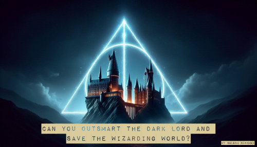

# The Quest for the Deathly Hallows 🪄⚰️🧥

This is a **2D magic-adventure game** developed using **JavaScript**, **HTML**, and **CSS** as part of the **Ironhack Web Development Bootcamp**. 
In this game, you play as a Hogwarts student trying to stop **Lord Voldemort** from acquiring the **Deathly Hallows** and using them to rule the magical world. 
Explore Hogwarts, face enemies, and collect the Hallows before Voldemort does!

📑 Table of Contents
- [🧙‍♂️ Overview](#overview)
- [🎮 DEMO](#demo)
- [✨ Features](#features)
- [📝 Key Learnings](#key-learnings)
- [🕹️ Controls](#controls)
- [🪜 Levels](#levels)
- [🛠️ Technologies Used](#technologies-used)
- [🔮 Future Improvements](#future-improvements)

---

## 🧙‍♂️ Overview
In this **JavaScript-based game**, you must explore Hogwarts, face magical enemies, and collect the **Deathly Hallows** before Voldemort does. 
He already holds the **Elder Wand**, and your goal is to stop him from obtaining the **Resurrection Stone** and the **Invisibility Cloak**. If Voldemort gets his hands on all three, he will gain immeasurable power and dominate the magical world.

- **Explore Hogwarts and the Forbidden Forest**: Face magical enemies, navigate through the school and the Forbidden Forest, and gather the first two Deathly Hallows before Voldemort does.
- **Final Duel**: The ultimate challenge is a duel with Voldemort for the Elder Wand. You must defeat him to stop him from completing his plan and saving the wizarding world.

---

## 🎮 DEMO
[Play the Quest for the Deathly Hallows](https://selenaschz.github.io/the-quest-for-the-deathly-hallows/index.html)

---

## ✨ Features
- **Hogwarts House Selection Test**: A quiz inspired by the Sorting Hat that assigns the player to a Hogwarts house based on their answer.
- **Player Controls**: Walk, jump, cast spells, and collect objects. 
- **Dynamic gameplay** with 3 levels and challenging enemies.
- **Collect the Deathly Hallows**: Gather the Resurrection Stone ⚰️(Level 1), Invisibility Cloak 🧥(Level 2) and the Elder Wand 🪄(Level 3 - Final Challenge).
- **Final Challenge**: Defeat Voldemort in a mini-game where you must correctly type spells with a 7-second time limit for each spell.
- **Player Health & Spells**: Limited spellcasting ability using setTimeout and health management (using chocolate frogs for healing).
- **Ranking System**: Top 5 high scores using localStorage.
- **Interactive and Responsive Menus**: View different screens, including rankings, and a responsive menu that adjusts according to screen size.
- **Game Over / Win Screen**: Includes options to restart or exit the game.

---

## 🧠 Key Learnings
This project gave me the opportunity to strengthen my **JavaScript**, **HTML**, and **CSS** skills while creating a fully interactive game. Some key concepts I worked with include:

- **Game Logic & Timers**: Managed real-time events such as spell cooldowns and timed challenges using setInterval and setTimeout.
- **OOP**: Organized the game into classes for enemies, magic items, and Deathly Hallows, using inheritance to define common properties and behaviors ensuring better structure and code reuse.
- **DOM Manipulation**: Switch between screens and display rankings.
- **Responsive Design**: Used media queries to ensure the game Menu is properly displayed across different devices.
- **State Management**: Implemented systems for managing player stats like health, score, and collected relics.
- **HTML & CSS**: Designed and structured the layout and styling of the game interface, including buttons, menus, and game screens.

---

## 🕹️ Controls
- **Up Arrow**: Jump
- **Space Bar**: Cast a spell to attack enemies and get points, with a 3-second cooldown before the next cast.
- **Down Arrow**: Collect the Deathly Hallows and Chocolate Frogs.
- **Left Arrow / Right Arrow**: Move left or right.

---

## 🪜 Levels
1. **Level 1 & 2**: Explore Hogwarts and The Forbidden Forest, collect the Resurrection Stone and the Invisibility Cloak, and defeat enemies to progress.
2. **Level 3 (Final Challenge)**: Face Voldemort in a typing duel to collect the Elder Wand.
   - Type spells correctly within 7 seconds to defeat Voldemort.
3. **Ranking & Restart**: After the final duel, enter your name to check your score in the ranking and choose to restart or exit.

---

## 🛠️ Technologies Used
- **JavaScript**: Game logic, event handling, timers, and interactions.
- **HTML**: Game structure and layout.
- **CSS**: Styling and responsive design for menus.
- **Canvas**: Used for rendering the game graphics and animations.

---

## 🔮 Future Improvements

- **More Enemies**: Add new types of enemies, each with unique movement patterns and abilities.
- **Spell Riddles**: Include magical puzzles where players must correctly answer spell-related riddles or cast the correct spell to advance. These puzzles will test players’ knowledge of spells and magic.
- **Deadly Obstacles**: Add hazards such as poisonous potions, Devil's Snare, and other dangerous traps to make the levels more challenging.
- **Moving Platforms**: Introduce moving platforms where the player must jump or climb to avoid obstacles or reach specific objectives.

